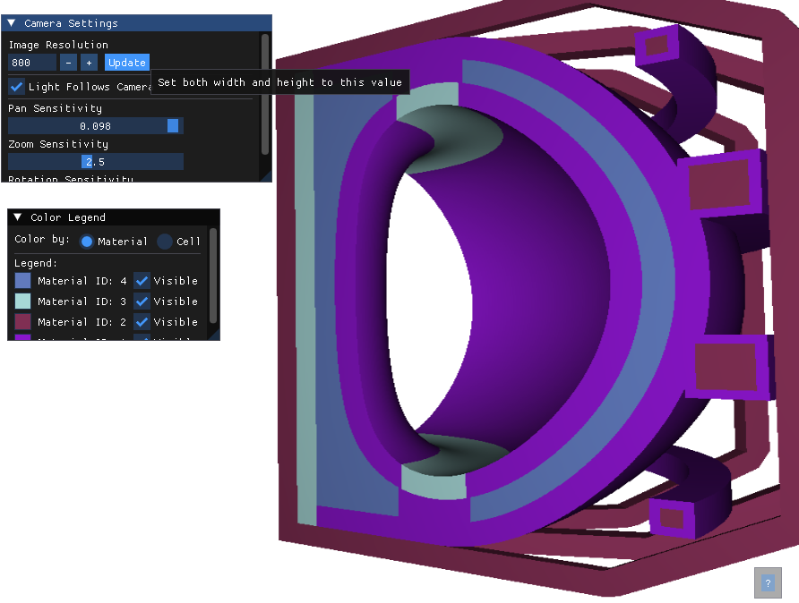

# openmc_renderer
Basic rendering app for OpenMC Geometry

A real-timey 3D visualization tool for OpenMC geometry models. This application provides interactive viewing of OpenMC geometries with features like dynamic lighting, material/cell coloring, and geometry querying.

🎥 [Watch Video Demo](https://youtu.be/dd3uzOabIdU)




## Dependencies

### OpenMC Requirements

Requires OpenMC isntalled with [this branch](https://github.com/pshriwise/openmc/tree/raytrace_plots_render) in my fork of the main repo.

### Ubuntu System Dependencies
```bash
# OpenGL and GLFW dependencies
sudo apt-get install libgl1-mesa-dev
sudo apt-get install libglfw3-dev

# Other build dependencies
sudo apt-get install cmake
sudo apt-get install build-essential
```

## Controls

### Camera Controls
- **Left Mouse Button + Drag**: Rotate camera around model
- **Middle Mouse Button + Drag**: Pan camera
- **Right Mouse Button + Drag**: Rotate view in-plane
- **Mouse Wheel**: Zoom in/out
- **I**: Reset to isometric view
- **X**: View along X axis (positive direction)
- **Y**: View along Y axis (positive direction)
- **Z**: View along Z axis (positive direction)
- **Shift + X**: View along X axis (negative direction)
- **Shift + Y**: View along Y axis (negative direction)
- **Shift + Z**: View along Z axis (negative direction)

### Lighting Controls
- **L + Left Mouse Button**: Rotate light around model
- **L + Middle Mouse Button**: Move light closer/further
- **Shift + L**: Toggle "Light Follows Camera" mode

### Geometry Query Controls
- **Q**: Query cell ID at cursor position
- **ESC**: Close cell query display

### Display Controls
- **?**: Toggle help overlay
- **ESC**: Close overlay or exit application
- **Ctrl + W/Q**: Exit application

### Interface Features
- **Color Legend**: Toggle between material and cell coloring
- **Material/Cell Visibility**: Toggle visibility of individual materials/cells
- **Color Customization**: Customize colors for materials/cells
- **Camera Settings**:
  - Adjust image resolution
  - Toggle light following camera
  - Adjust pan sensitivity
  - Adjust zoom sensitivity
  - Adjust rotation sensitivity

## Qt/Python Renderer (Experimental)

There is a Python + Qt viewer under `Python/` that can be embedded as a pop-up
window in a larger Qt application. It uses PySide6 for the UI, PyOpenGL for
display, and the OpenMC shared library for rendering via a small C API bridge.
This makes it easy to host the OpenMC renderer as a dialog or dockable panel
inside your own Qt tools without running a separate process.

### Embed Example (PySide6)

```python
from PySide6 import QtWidgets
from Python.openmc_plotter import OpenMCPlotter
from Python.gl_widget import GLPlotWidget

class OpenMCRenderDialog(QtWidgets.QDialog):
    def __init__(self, parent=None, openmc_args=None):
        super().__init__(parent)
        self.setWindowTitle("OpenMC Renderer")
        self.resize(900, 700)

        self.plotter = OpenMCPlotter(args=openmc_args or [])
        self.gl_widget = GLPlotWidget(self.plotter)

        layout = QtWidgets.QVBoxLayout(self)
        layout.addWidget(self.gl_widget)

# Usage in an existing Qt app:
# dlg = OpenMCRenderDialog(parent=self)
# dlg.show()
```
